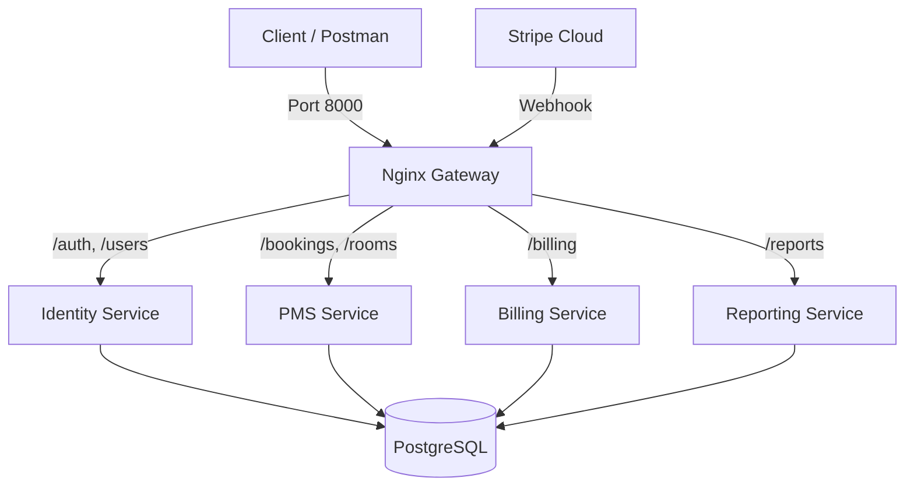

# System Documentation - Hotel SaaS Platform

## 1. Executive Summary
This is a microservices-based Property Management System (PMS) designed for Hotel Receptionists. It handles **User Identity**, **Room Booking Management**, **Subscription Billing** (Stripe), and **Data Reporting**.

The system is containerized (Docker), routed via an API Gateway (Nginx), and uses a shared PostgreSQL database.

## 2. Architecture Overview

### Microservices
| Service | Container Name | Internal Port | Description |
| :--- | :--- | :--- | :--- |
| **Gateway** | `mottest-gateway` | `80` | Nginx Reverse Proxy. Entry point for all traffic. |
| **Identity** | `mottest-identity` | `8001` | Handles Login (JWT) and User Management. |
| **PMS** | `mottest-pms` | `8002` | Core Logic: Hotels, Rooms, Bookings, Check-in/out. |
| **Billing** | `mottest-billing` | `8003` | Stripe Integration. Listens for Webhooks to update subscriptions. |
| **Reporting** | `mottest-reporting`| `8004` | Generates CSV reports (using Pandas) for analytics. |

### Infrastructure
-   **Database**: PostgreSQL 13 (`mottest-db`). Shared by all services.
-   **Orchestration**: Docker Compose.

### Diagram


## 3. Directory Structure
```text
/
├── alembic/                # Database Migrations (Shared)
├── services/               # Microservices Source Code
│   ├── identity/           # Auth & User Logic
│   ├── pms/                # Hotel Management Logic
│   ├── billing/            # Stripe Webhook Handler
│   └── reporting/          # Analytics & CSV Generation
├── shared/                 # Shared Library (Common Code)
│   ├── models.py           # SQLAlchemy Models (Single Source of Truth)
│   ├── schemas.py          # Pydantic Schemas
│   ├── database.py         # DB Engine
│   └── utils.py            # Helper functions
├── docker-compose.yml      # Container Definition
├── nginx.conf              # API Gateway Routing
└── requirements.txt        # Python Dependencies
```

## 4. Key Database Models (`shared/models.py`)

### `Hotels`
-   **Purpose**: Represents a tenant (Hotel).
-   **Key Fields**: `hotel_id`, `name`, `terms_and_conditions`, `subscription_valid` (Bool), `valid_to` (Datetime).

### `HotelUsers`
-   **Purpose**: Staff members (Receptionists).
-   **Key Fields**: `user_id`, `username`, `password_hash`, `hotel_id` (FK).

### `Rooms`
-   **Purpose**: Inventory.
-   **Key Fields**: `room_id`, `room_number`, `rate`, `status`, `hotel_id` (FK).

### `Bookings`
-   **Purpose**: Reservation records.
-   **Key Fields**: `booking_id`, `check_in_at`, `expected_check_out_at`, `total_amount`, `status`.

## 5. API Reference (Key Endpoints)

### Identity Service
-   `POST /auth/token`: Login (Get JWT).
-   `POST /users/`: Create new staff user.

### PMS Service
-   `GET /rooms/available`: Find free rooms by date.
-   `POST /bookings/`: Create a reservation.
-   `PATCH /operations/check-in/{id}`: Check-in a guest.
-   `PATCH /operations/check-out/{id}`: Check-out a guest.

### Billing Service
-   `POST /billing/webhook`: Receives Stripe events (`invoice.payment_succeeded`) to extend `Hotels.valid_to`.

### Reporting Service
-   `POST /reports/bookings`: Generate CSV report of bookings (Async stream).

## 6. Configuration & Running

### Environment Variables (`docker-compose.yml`)
-   `DATABASE_URL`: `postgresql://admin:admin123@db:5432/mottestdb`
-   `SECRET_KEY`: For JWT signing.
-   `STRIPE_API_KEY`: Secret Key from Stripe Dashboard.
-   `STRIPE_WEBHOOK_SECRET`: WhSec key for signature verification.

### How to Run
```bash
# 1. Start System
docker compose up --build -d

# 2. Run Migrations (First Time)
docker compose exec pms alembic upgrade head

# 3. Access API
http://localhost:8000
```
